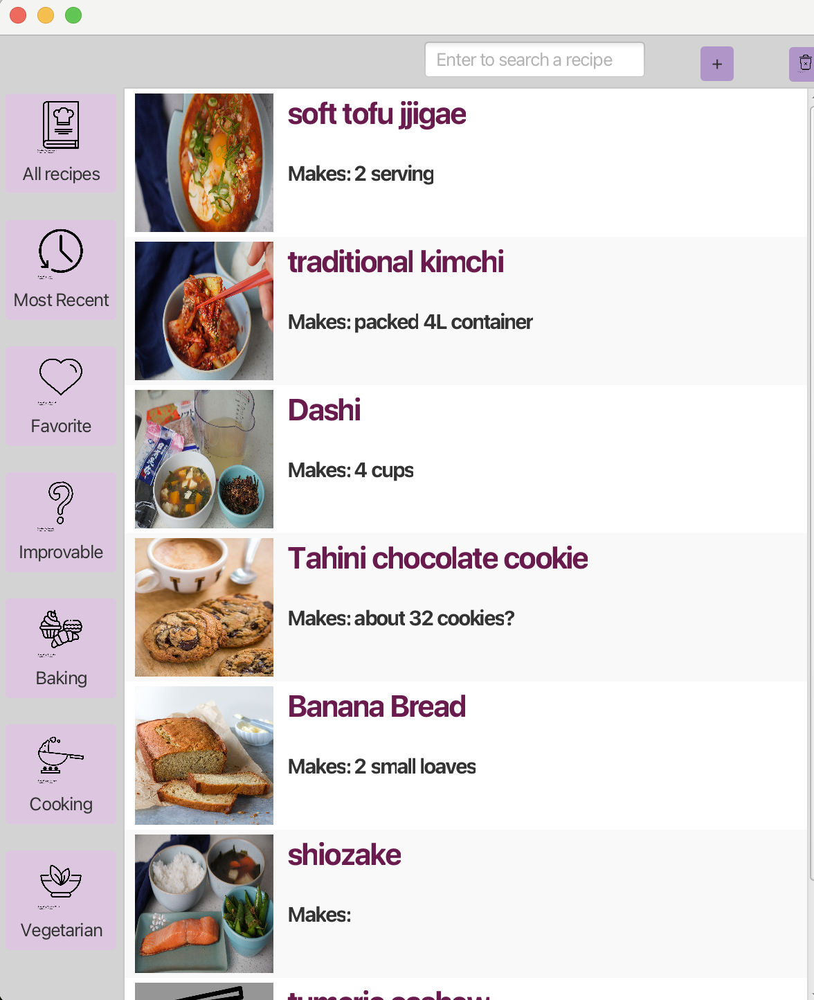
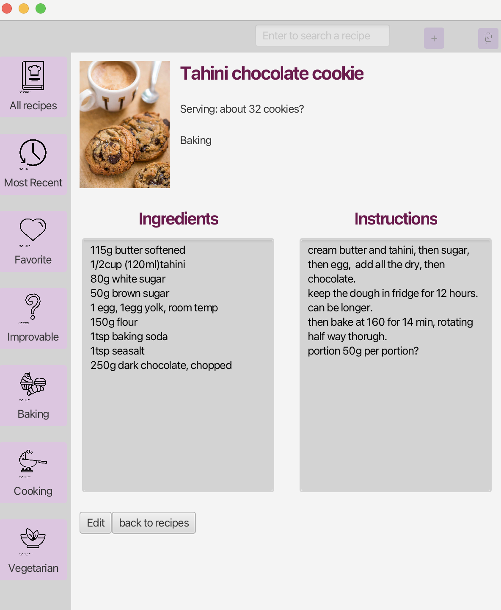
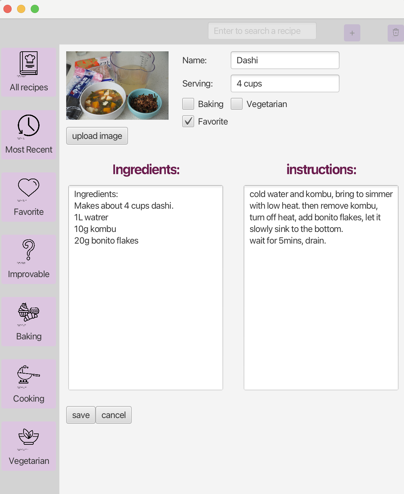
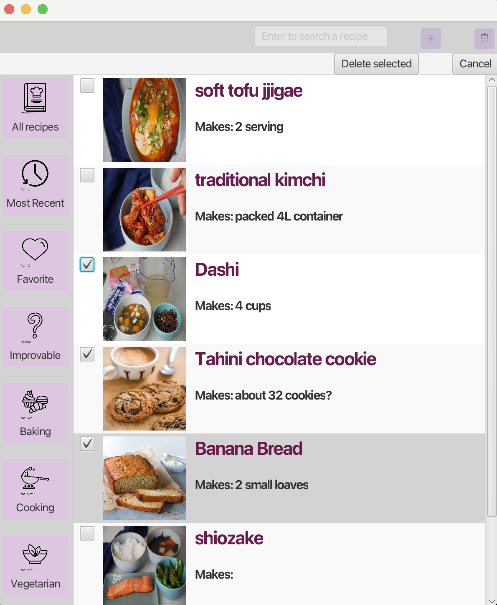

# Recipe Manager

A JavaFX-based desktop application for managing and organizing recipes, demonstrating proficiency in Java development, UI design, and database integration.

### Main Recipe List View

*Main interface showing recipe list with search and filter capabilities*

### Recipe Detail View

*Detailed view of a recipe showing ingredients, instructions, and image*

### Recipe Editor

*Interface for creating and editing recipes*

### Recipe batch deletion

*Ability to select and delete recipes in batch*

## Features

- **Recipe Management**
  - Create, edit, save and delete recipes
  - Add detailed ingredients and cooking instructions
  - Specify serving sizes and cooking categories
  - Upload and display recipe images
  

- **Smart Organization**
  - Filter recipes by multiple categories:
    - Baking vs. Cooking
    - Vegetarian options
    - Tested/Favorite recipes
    - Recent additions
  - Search functionality for quick recipe lookup
  - Intuitive navigation system with category filters

- **User-Friendly Interface**
  - Clean, modern design with JavaFX
  - Easy-to-use recipe editor
  - List and detail views for recipes

## Technical Implementation

### Key Technologies
- **Java & JavaFX**: Core application development
- **SQLite**: Local database for recipe storage
- **JDBC**: Database connectivity
- **CSS**: Custom styling for the UI

### Database Design
- Efficient schema for storing recipe information
- CRUD operations implementation
- Proper data validation and error handling

## Code Structure
```
src/
├── application/
│   ├── Main.java           # Application entry point
│   └── application.css     # Global styles
├── logic/
│   ├── Recipe.java         # Recipe model
│   ├── RecipeBook.java     # Recipe collection management
│   ├── RecipeDAO.java      # Database operations
│   └── Category.java       # Recipe categorization
└── userInterface/
    ├── Root.java           # Main UI container
    ├── AddRecipeView.java  # Recipe creation/editing
    ├── RecipeView.java     # Recipe display
    ├── RecipeListView.java # Recipe list
    └── ControllerBar.java  # UI controls
```
## Getting Started
1. Clone the repository
2. Ensure Java and JavaFX are installed
3. Set up SQLite database
4. Run Main.java

## Requirements
- Java 11 or higher
- JavaFX
- SQLite
- IDE with JavaFX support (e.g., Eclipse, IntelliJ IDEA)
